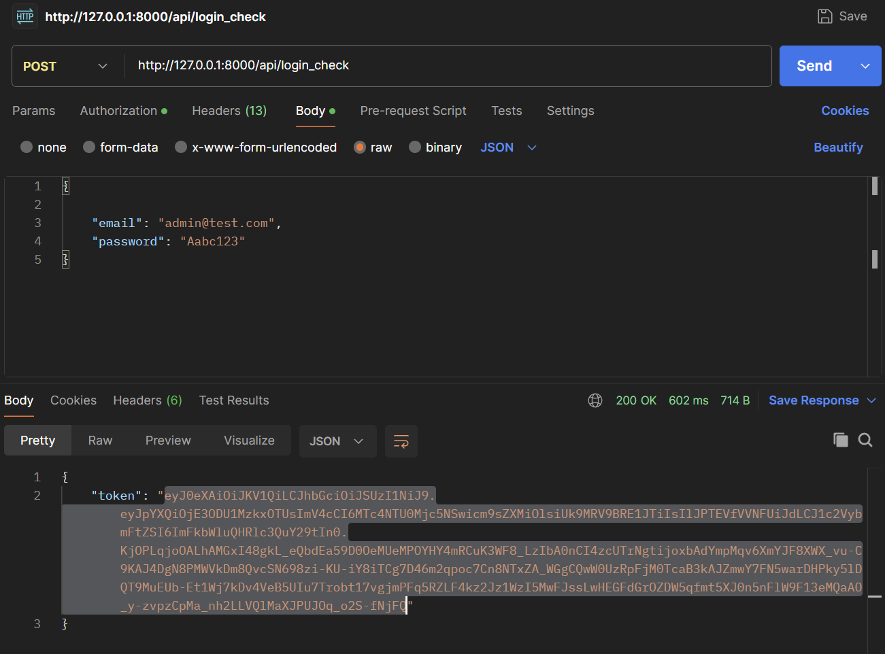
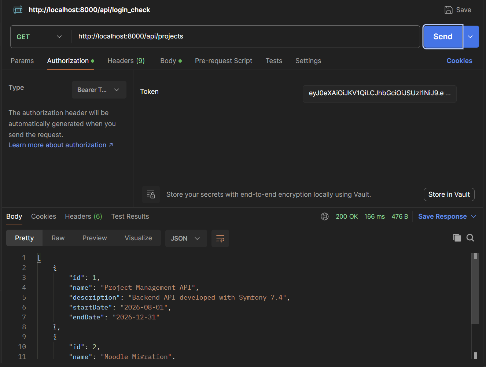
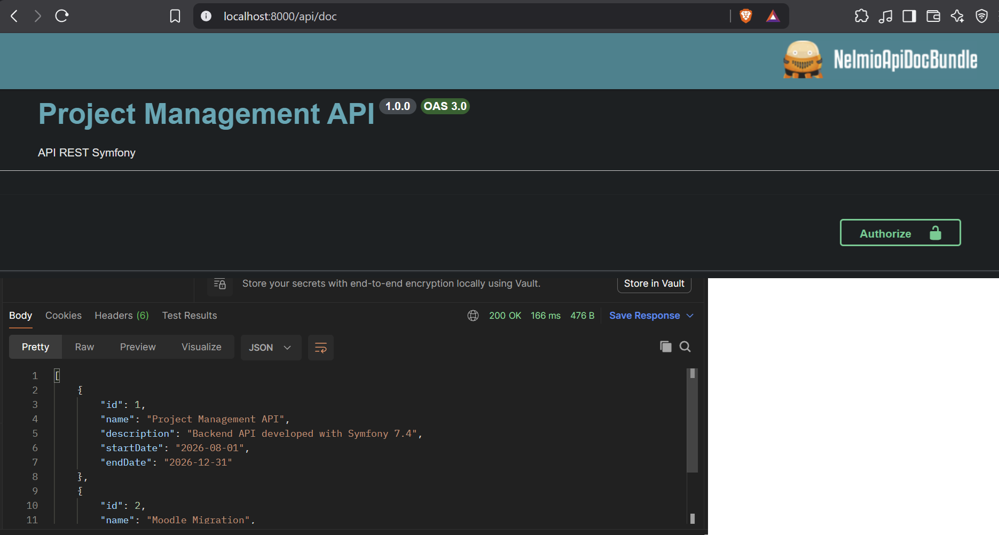
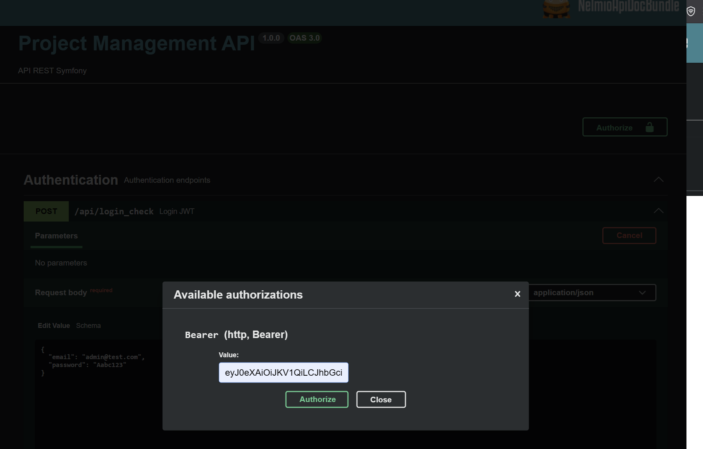

# Project Management API

REST API developed with **Symfony 7.4 LTS** and **PHP 8.3** for managing projects, employees and tasks.

Features:

- JWT authentication
- CRUD operations for Projects, Employees and Tasks
- Task filtering
- Swagger API documentation

---

## Requirements

- PHP >= 8.3
- Composer
- MySQL 8
- Symfony CLI (recommended)

---

# Installation

## 1. Clone repository

```bash
git clone https://github.com/RaZaC-WP/project-management-api.git

cd project-management-api
```

## 2. Install dependencies

```bash
composer install
```

---

## 3. Configure environment

Create `.env.local`:

```dotenv
DATABASE_URL="mysql://root:@127.0.0.1:3306/project_management?serverVersion=8.0.32&charset=utf8mb4"
```

---

# JWT Configuration

The API uses JWT authentication with LexikJWTAuthenticationBundle.

## OpenSSL Configuration on Windows

This project uses JWT authentication with RSA keys, which requires a properly configured OpenSSL environment in PHP.

In some Windows environments (for example, when using WampServer), the PHP OpenSSL extension may be enabled, but OpenSSL may not find its configuration file automatically. In this case, it is necessary to define the `OPENSSL_CONF` environment variable pointing to the OpenSSL configuration file.

Example:

```cmd
set OPENSSL_CONF=C:\wamp64\bin\php\php8.3.0\extras\ssl\openssl.cnf

## 1. Configure JWT paths

Add the following configuration to `.env.local`:

```dotenv
JWT_SECRET_KEY=%kernel.project_dir%/config/jwt/private.pem
JWT_PUBLIC_KEY=%kernel.project_dir%/config/jwt/public.pem
JWT_PASSPHRASE=
```
---

## 2. Generate a passphrase

Generate a secure passphrase:

```bash
openssl rand -hex 32
```

Copy the generated value and configure it in `.env.local`:

```dotenv
JWT_PASSPHRASE="<generated_passphrase>"
```

---

## 3. Generate JWT keys

JWT private keys are generated locally and are not included in the repository.

Generate the JWT key pair:

```bash
php bin/console lexik:jwt:generate-keypair
```

This creates:

```
config/jwt/private.pem
config/jwt/public.pem
```

---


# Database setup

Create database:

```bash
php bin/console doctrine:database:create
```

Run migrations:

```bash
php bin/console doctrine:migrations:migrate
```

Load test data:

```bash
php bin/console doctrine:fixtures:load
```

Fixtures include:

- Users
- Employees
- Projects
- Tasks

---

# Run application

```bash
symfony server:start
```

Application:

```
http://localhost:8000
```

---

# Authentication

Login endpoint:

```
POST /api/login_check
```

Example:

```json
{
    "username": "admin@test.com",
    "password": "Aabc123"
}
```

Response:

```json
{
    "token": "JWT_TOKEN"
}
```

Use:

```
Authorization: Bearer JWT_TOKEN
```

The JWT token returned after login is required for all protected REST API requests.

When using Postman, select **Bearer Token** in the **Authorization** tab and paste the token into the **Token** field.




When using the API documentation(http://localhost:8000/api/doc), click the **Authorize** button, enter the token in the **Value** field, and confirm.




The token will be sent in the request header as:

```http
Authorization: Bearer JWT_TOKEN

```
GET /
```

Example response:

```json
{
    "name": "Project Management API",
    "status": "running",
    "documentation": "/api/doc"
}
```

---

# API Documentation

Swagger:

The Swagger documentation contains the complete API specification, including request schemas and responses.

```
http://localhost:8000/api/doc
```

---

# Main endpoints

### Projects

```
GET    /api/projects
POST   /api/projects
GET    /api/projects/{id}
PUT    /api/projects/{id}
DELETE /api/projects/{id}
```

### Employees

```
GET    /api/employees
POST   /api/employees
GET    /api/employees/{id}
PUT    /api/employees/{id}
DELETE /api/employees/{id}
```

### Tasks

```
GET    /api/tasks
POST   /api/tasks
GET    /api/tasks/{id}
PUT    /api/tasks/{id}
DELETE /api/tasks/{id}
```

Task filters:

```
GET /api/tasks?status=DONE
GET /api/tasks?project=1
GET /api/tasks?employee=1
```

# Error handling

The API returns JSON responses for errors.

Example:

```json
{
    "error": "Endpoint not found"
}
```

Common HTTP status codes:

| Code | Description |
|---|---|
| 400 | Validation error |
| 401 | Authentication required |
| 404 | Resource not found |
| 409 | Conflict |
| 500 | Internal server error |

---

# Test user

Created automatically with fixtures:

```
Email:
admin@test.com

Password:
Aabc123
```
